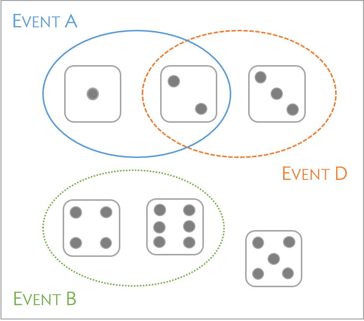
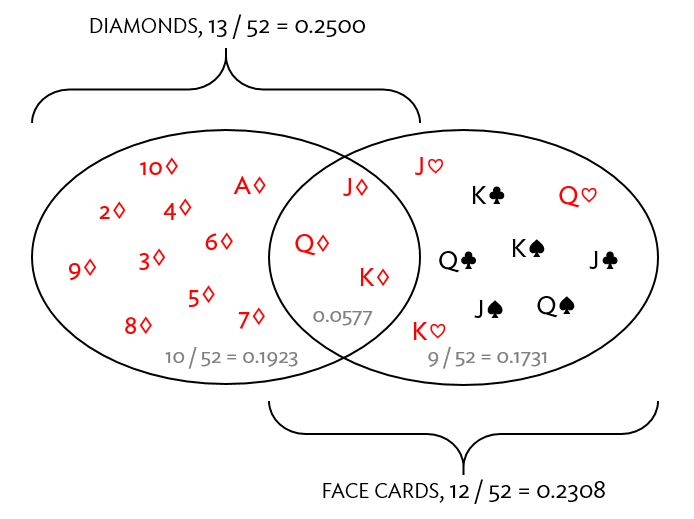
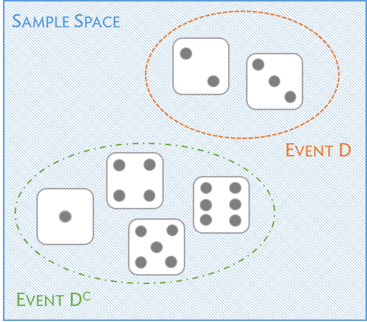
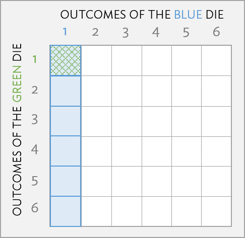
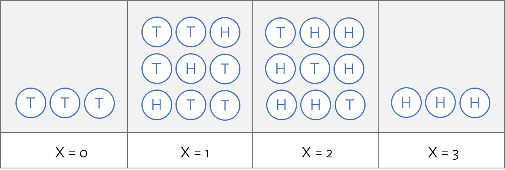
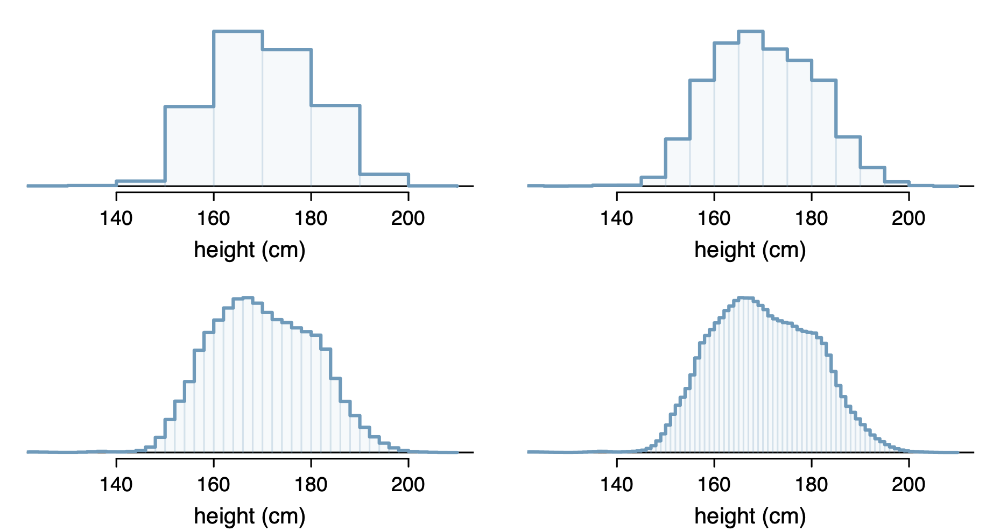
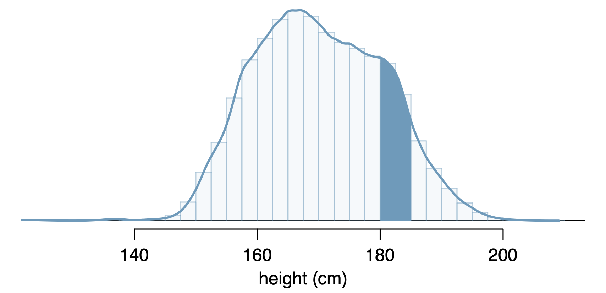

# Learning objectives

<style>
body {
text-align: justify;
font-family: Helvetica;
font-size: 10pt;
}
hr{
height: 2px;
background-color: #000000;
border: none;
}
table, th, td {
  border: 1px solid black;
  border-collapse: collapse;
}
</style>

```{r setup, include = FALSE}
knitr::opts_chunk$set(fig.align='center')

colourise <- function(x, color) {
  if (knitr::is_latex_output()) {
    sprintf("\\textcolor{%s}{%s}", color, x)
  } else if (knitr::is_html_output()) {
    sprintf("<span style='color: %s;'>%s</span>", color,
      x)
  } else x
}

librarian::shelf(tidyverse, ggplot2, here, readxl, GGally, forecast, patchwork, MLmetrics, lmtest, latex2exp, scales)
```

At the end of this review, you will be able to 

  1. Recall basic notions of probability 
      - Coding skill: estimating probabilities through simulated repetitions of an experiment. 
  
  2. Understand notions of conditional probability.
      - Coding skill: implementing control structures through use of `if` statements and simulating populations based on conditional probabilities.
      
  3. Link random variables to concepts of probability. 
      - Coding skill: generating random samples from a given distribution and using Monte Carlo methods to estimate distribution parameters.
  
  4. Analyse basic properties of some common random variables.
      - Coding skill: explore of the relationships between prevalence, sensitivity, specificity and positive predictive value through a real-world example.
  

<center><center>


# 1A: Introduction 

People often colloquially refer to probability...

- "What are the chances the Red Sox will win this weekend?" 
- "What's the chance of rain tomorrow?"
- "What is the chance that a patient responds to a new therapy?"

**Formalizing concepts and terminology around probability is essential for improved understanding.**

# 1B: Random experiments

- A `r colourise("**random experiment**", "red")` is an action or process that leads to one of several possible outcomes.
    - `r colourise("Rolling two dice simultaneously", "forestgreen")`.
    - `r colourise("Studying treatment response of individuals enrolled in a study", "blue")`.


- An `r colourise("**outcome**", "red")` is the observable result after conducting the experiment.
    - `r colourise("The sum of the faces on two dice that have been rolled", "forestgreen")`.  
    - `r colourise("The number of patients in a study who respond ‘well’ to therapy", "blue")`.

- An `r colourise("**event**", "red")` is a collection of outcomes.  
    - `r colourise("The sum after rolling two dice is 7", "forestgreen")`.
    - `r colourise("22 of 30 patients in a study have a good response to a therapy", "blue")`.

# 1C: Formalising our notion of probability (somewhat)

`r colourise("**Probability**", "red")` is used to assign a level of uncertainty to the outcomes of phenomena that either happen randomly (e.g. `r colourise("rolling dice", "forestgreen")`) or appear random because of a lack of understanding about exactly how the phenomenon occurs (e.g., `r colourise("patient response to medical treatment", "blue")`). 


`r colourise("**The probability of an outcome is the proportion of times the outcome would occur if the random phenomenon could be observed an infinite number of times.**", "red")`

- If a fair coin is flipped an infinite number of times, heads would be obtained 50% of the time.

```{r echo = FALSE}

# _____ Simulate _____ #
set.seed(51)
n <- 10^5
x <- sample(0:1, n, TRUE, p = c(1/2, 1/2))
y <- cumsum(x) / 1:n
X <- c(1:100, seq(102, 500, 2),
	seq(510, 1500, 10), seq(1550, 10000, 50),
	seq(10100, 25000, 100), seq(25250, 100000, 250))
Y <- y[X]

# _____ Plotting _____ #
data.frame(X, Y) %>% 
  ggplot(aes(x = X, y = Y)) + 
  geom_line(color = "blue") +
  scale_x_log10(breaks = scales::log_breaks(n = 10)) +
  annotation_logticks(sides = "b", short = unit(0, "cm"),
  mid = unit(0, "cm"),) +
  geom_hline(yintercept = 0.5) +
  xlab("n (number of rolls)") + 
  ylab(TeX("$\\hat{p}_n$")) + 
  theme_bw() 
```

# 1D: Disjoint events

Two events or outcomes are called disjoint or mutually exclusive if they cannot both happen at the same time. 

If $A$ and $B$ represent two disjoint events, then the probability that either occurs is $$P(A \cup B) = P(A \text{ or } B) = P(A) + P(B).$$

```{r, echo=FALSE, fig.align='center', fig.width=10, fig.height=7}

```

- `r colourise("$A:$ rolling a number less than three.", "blue")`

- `r colourise("$B:$ rolling an even number more than two.", "green")`

- `r colourise("$D:$ rolling a two or a three", "orange")`

<center>

`r colourise("A and B are disjoint; B and D are disjoint but ", "black")` `r colourise("A and D are not.", "red")` 

`r colourise("What is $P(A \\cup B)$?", "red")`

</center>

# 1E: Addition rule for disjoint outcomes and inclusion-exclusion principle.

If there are $k$ disjoint events $A_1, A_2, \ldots, A_k$, then  the probability that at least one of these outcomes will occur is

$$P(A_1 \text{ or } A_2 \text{ or } \ldots A_k) = \sum_{i=1}^k P(A_i).$$
<center>

<hr>

`r colourise("What if the events are not disjoint, but ‘overlapping’?", "red")`</center>

```{r, echo=FALSE, fig.align='center', fig.width=12, fig.height=9}

```

Let $A$:= drawing a diamond and $B$:= drawing a face card. What is $P(A \cup B)?$


<center>
`r colourise("Have to account for double-counting!", "red")`

<hr>

Thus, for two events $A$ and $B$, the probability that either occurs is

$$P(A \cup  B) = P(A) + P(B) - P(A \cap B),$$
where the ‘cup’ $\cup$ symbol denotes the union of two events and the ‘cap’ $\cap$ symbol denotes the intersection of two events. `r colourise("This is the general addition rule.", "red")`
</center>

# 1F: Complement of an event.

```{r, echo=FALSE, fig.align='center', fig.width=12, fig.height=9}

```


<center>
Let $D = \{2, 3 \}$ represent the event that the outcome of a die roll is 2 or 3. 
</center>

The `r colourise("complement of an event ", "red")` $D$, denoted by $D^C$ represents all outcomes of the experiment that are NOT in  $D$. 

$D$ and $D^C$ are related in the following probabilistic sense: 

<center>
`r colourise("$P(D) + P(D^C) = 1$.", "red")`  
</center>

# 1H: Independence
<center>


If $A$ and $B$ represent events from two different and independent processes, then the probability that both $A$ and $B$ occur is given by

$$P(A \cap B) = P(A) \times P(B).$$

```{r, echo=FALSE, fig.align='center', fig.width=12, fig.height=12}

```


`r colourise("A blue die and a green die are rolled **separately**; what is the probability of rolling two 1's?", "red")`
</center>


# Lab 1: Basic concepts of probability

Notes for review may be found [here](https://rpubs.com/soumikp/bdsi2022ProbHandout).

**Question: Suppose that a biased coin is tossed 5 times; the coin is weighted such that the probability of obtaining a heads is 0.6. What is the probability of obtaining exactly 3 heads?**

## Exercise 1 of 2: `sample()`
<details><summary>Click here for more details</summary>
Before writing the code for a simulation to estimate probability, it is helpful to clearly define the experiment and event of interest. In this case, the experiment is tossing a biased coin 5 times and the event of interest is observing exactly 3 heads.

The following code illustrates the use of the `sample()` command to simulate the result for one set of 5 coin tosses.

```{r, eval = FALSE}
#define parameters
prob.heads =  ## FILL THIS IN!! 
number.tosses =   ## FILL THIS IN!! 
#simulate the coin tosses
outcomes = sample(c(0, 1), 
                  size = number.tosses,
                  prob = c(1 - prob.heads, prob.heads), replace = TRUE)
#view the results
table(outcomes)
#store the results as a single number
total.heads = sum(outcomes)
total.heads
```

a) Using the information given about the experiment, set the parameters for `prob.heads` and `number.tosses` and run the code chunk. 
<details>  <summary>Click here for answer</summary>
    `r colourise("prob.heads = 0.6", "red")` 
    
    `r colourise("number.tosses = 5", "red")`
   </details>

b) To generate `outcomes`, the `sample()` command draws from the values `0` and `1` with probabilites corresponding to those specified by the argument `prob`. Which number corresponds to heads, and which corresponds to tails? 
<details>  <summary>Click here for answer</summary>
  `r colourise("The number 0 corresponds to tails and 1 corresponds to heads. This information comes from the structure of the vectors used in the sample() command; the elements in c(0, 1) are sampled with probabilities c(1 - prob.heads, prob.heads), respectively.", "red")`
  </details>
  
c) Why is it important to sample with replacement? 
<details>  <summary>Click here for answer</summary>
  `r colourise("There are only two numbers being sampled from: 0 and 1. From a coding perspective, sampling without replacement would only allow for two coin tosses, since the vector contains only two elements. From a statistical perspective, sampling with replacement allows any coin to have the outcome 0 (tails) or 1 (heads), even if another coin was observed to be heads or tails; i.e., sampling with replacement allows the coin tosses to be independent.", "red")`
  </details>
  
d) What is the advantage of representing the outcomes with the values `0` and `1`, rather than with letters like "T" and "H"? 
<details>  <summary>Click here for answer</summary>
  `r colourise("Representing the outcomes with 0 and 1 allows for the use of sum() to return the number of heads. Note that sum() can also be used if the outcomes are represented with letters, but the syntax is slightly more complex; this method is shown in the Notes section below.", "red")`</details>

e) Run the code chunk again to simulate another set of 5 coin tosses. Is it reasonable to expect that the results might differ from the first set of tosses? Explain your answer.<details>  <summary>Click here for answer</summary>
  `r colourise("Yes, it is reasonable to expect that the number of heads in a set 5 coin tosses will not always be the same, even as the probability of a single heads remains constant. The inherent randomness makes it possible to observe anywhere between 0 and 5 heads (inclusive) in any set of 5 tosses.", "red")`</details>
  
<hr>

</details>
## Exercise 2 of 2: `for`
<details><summary>Click here for more details</summary>
The following code uses a `for` loop to repeat (i.e., replicate) the experiment and record the results of each replicate. The term `k` is an index, used to keep track of each iteration of the loop; think of it as similar to the index of summation $k$ (or $i$) in sigma notation ($\sum_{k = 1}^n$). The value `num.replicates` is set to 50, specifying that the experiment is to be repeated 50 times. The command `set.seed() `is used to draw a reproducible random sample; i.e., re-running the chunk will produce the same set of outcomes.
 

```{r, eval = FALSE}
#define parameters
prob.heads = 0.6
number.tosses = 5
number.replicates = 50
#create empty vector to store outcomes
outcomes = vector("numeric", number.replicates)
#set the seed for a pseudo-random sample
set.seed(20220621)
#simulate the coin tosses
for(k in 1:number.replicates){
  
  outcomes.replicate = sample(c(0, 1), size = number.tosses,
                      prob = c(1 - prob.heads, prob.heads), replace = TRUE)
  
  outcomes[k] = sum(outcomes.replicate)
}
```

a) The parameters of the experiment have already been filled in; the probability of heads remains 0.6 and the number of tosses is set to 5. This code repeats the experiment 50 times, as specified by `number.replicates`. Run the code chunk. 
<details> 
    <summary>Click here for answer</summary>
    ```{r, eval = TRUE, echo = FALSE}
#define parameters
prob.heads = 0.6
number.tosses = 5
number.replicates = 50
#create empty vector to store outcomes
outcomes = vector("numeric", number.replicates)
#set the seed for a pseudo-random sample
set.seed(20220621)
#simulate the coin tosses
for(k in 1:number.replicates){
  
  outcomes.replicate = sample(c(0, 1), size = number.tosses,
                      prob = c(1 - prob.heads, prob.heads), replace = TRUE)
  
  outcomes[k] = sum(outcomes.replicate)
}
```
    ```{r}
    #view the results
    outcomes
    addmargins(table(outcomes))
    heads.3 = (outcomes == 3)
    table(heads.3)
    ```
   </details>

b) How many heads were observed in the fourth replicate of the experiment? Hint: look at `outcomes` 
<details>
  <summary>Click here for answer</summary>
    ```{r include = TRUE} 
    outcomes[4]
    ```
    `r colourise("In the fourth replicate of the experiment, 2 heads were observed.", "red")`
  </details>
  
c) Out of the 50 replicates, how often were exactly 3 heads observed in a single experiment? <details>
  <summary>Click here for answer</summary>
    ```{r include = TRUE} 
    sum(outcomes == 3)
    ```
    `r colourise("Out of the 50 replicates, exactly 3 heads were observed in 18 of the replicates.", "red")`
  </details>
  
d) From the tabled results of the simulation, calculate an estimate of the probability of observing exactly 3 heads when the biased coin is tossed 5 times. <details>
  <summary>Click here for answer</summary>
    ```{r include = TRUE} 
    sum(outcomes == 3)/length(outcomes)
    ```
    `r colourise("The estimate of the probability is 18/50 = 0.36.", "red")`
  </details>

e) Re-run the simulation with 10,000 replicates of the experiment; calculate a new estimate of the probability of observing exactly 3 heads when the biased coin is tossed 5 times.
   <details>  <summary>Click here for answer</summary>
    ```{r, eval = TRUE, echo = FALSE}
#define parameters
prob.heads = 0.6
number.tosses = 5
number.replicates = 10000
#create empty vector to store outcomes
outcomes = vector("numeric", number.replicates)
#set the seed for a pseudo-random sample
set.seed(20220621)
#simulate the coin tosses
for(k in 1:number.replicates){
  
  outcomes.replicate = sample(c(0, 1), size = number.tosses,
                      prob = c(1 - prob.heads, prob.heads), replace = TRUE)
  
  outcomes[k] = sum(outcomes.replicate)
}
```

    ```{r include = TRUE} 
    sum(outcomes == 3)/length(outcomes)
    ```
    
    `r colourise("The (more reliable) estimate of the probability is = 0.3443.", "red")`
  </details>
</details>


# 2: Conditional probability and independence

>- `r colourise("$P(A|B)$", "red")`: conditional probability of an event $A$, given a second event $B$, is the probability of $A$ happening, knowing that the event $B$ has happened. <hr> Consider height in the US population.

>- `r colourise("What is the probability that a randomly selected male in the population is taller than 6 feet, 4 inches?", "red")`

>- Suppose you learn that the individual is a professional basketball player. 

>- `r colourise("Does this change the probability that the individual is taller than 6 feet, 4 inches?", "green")`.

>- $A:$ randomly selected male in the population is taller than 6 feet, 4 inches, and $B$: randomly selected male is a professional basketball player. 

>- Marginal probabilities: $P(A)$ or $P(B)$; joint probability: $P(A \cap B)$. `r colourise("**We want $P(A|B)$**", "green")` <hr>

>- Example: Toss a fair coin three times. Let $A$ be the event that exactly two heads occur, and $B$ the event that at least two heads occur. 

>- $P(A|B)$ is is the probability of having exactly two heads among the outcomes that have at least two heads.

>- Sample space after conditioning on $B: \{HHH, HHT, HTH, THH\}$.

>- Outcomes associated with event $A:  \{HHT, HTH, THH\}$.

>- $P(A|B) = 3/4.$ <hr>

>- We must ensure the event we are conditioning on is not an impossible event, i.e., $P(B) \neq 0$. We define conditional probability of $A$ conditioned on $B$ as follows: $$P(A|B) = \frac{P(A \cap B)}{P(B)}.$$ <hr>

>- Link with independence: if $P(A|B) = P(A)$, then $A$ and $B$ are independent. `r colourise("Knowing whether $B$ happened or not offers no information about whether $A$ occurred.", "red")`


# Lab 2A: Bayes' theorem through an example: Motivating problem
## Breast cancer screening 

>- `r colourise("Screening is looking for signs of disease, such as breast cancer, before a person has symptoms. ", "red")` The goal of screening tests is to find cancer at an early stage when it can be treated and may be cured. 

>- Scientists are trying to better understand which people are more likely to get certain types of cancer. 

>- For example, they look at the person's age, their family history, and certain exposures during their lifetime. This information helps doctors recommend who should be screened for cancer, which screening tests should be used, and how often the tests should be done. 

>- Mammography is the most common screening test. An important clinical question is: `r colourise("What are the chances that a woman with an abnormal mammogram has breast cancer?", "red")` 

>- For clinicians, the question above may be reformulated: `r colourise("what is the conditional probability that a woman has breast cancer, given that her mammogram is abnormal?", "red")` 

>- This conditional probability is called the **positive predictive value (PPV)** of a mammogram. 

>- More concisely, if 
$$A = \{\text{a woman has breast cancer}\},$$ and $$B = \{\text{a mammogram is positive}\},$$ the PPV of a mammogram is $P(A|B)$.

>- `r colourise("Learning objective: use our understanding of **conditional probability** and learn more about **Bayes' theorem** to calculate the PPV of a mammogram.", "blue")`

# Lab 2B: Bayes' theorem through an example: Formulating the problem

>- The characteristics of a mammogram (and other diagnostic tests) are given with the reverse conditional probabilities. 

>- The probability that the mammogram correctly returns a positive result if a woman has breast cancer (i.e., $P(B|A)$), 

>- The probability that the mammogram correctly returns a negative result if a woman does not have breast cancer (i.e., $P(B^C|A^C)$). 

>- We will assume there is (usually historical) evidence that tells us what the marginal probability of disease (i.e., $P(A)$) is. 

>- `r colourise("**The problem: Given the probabilities $P(B|A)$ and $P(B^C|A^C)$, as well as the marginal probability of disease $P(A)$, how can the positive predictive value $P(A|B)$ be calculated?**", "red")`

>- There are several possible strategies for approaching this type of problem; we will focus on `r colourise("using a purely algebraic approach using Bayes’ Theorem.", "blue")` <hr>

>- The simplest form of Bayes' theorem states $$P(A|B) = \frac{P(B|A) \times P(A)}{P(B)}.$$

>- Bayes’ Theorem is seldom stated in its simplest form, because in many problems, $P(B)$ is not given directly, but is calculated using the general multiplication formula for probabilities: $$P(B) = P(B \cap A) + P(B \cap A^C) = P(B|A)P(A) + P(B|A^C)P(A^C).$$

>- Allowing us to rewrite Bayes' theorem as $$P(A|B) = \frac{P(B|A) \times P(A)}{P(B|A)P(A) + P(B|A^C)P(A^C)}.$$


# Lab 2C: Bayes' theorem through an example: Defining events in diagnostic testing

::: columns

:::: {.column width=50%}
- Events of interest include    

    -`r colourise("$A$ = {disease present}", "black")`
    
    -`r colourise("$A^C$ = {disease absent}", "black")`
    
    -`r colourise("$B$ = {positive test result}", "black")`
    
    -`r colourise("$B^C$ = {negative test result}", "black")`.
::::

:::: {.column width=50%}
- Based on the quantities above, we derive characteristics of a diagnostic test.
    
    -`r colourise("**Sensitivity = $P(B|A)$**", "brown")`
    
    -`r colourise("**Specificity = $P(B^{C} | A^C)$**", "purple")`
::::

:::

>- Want to find `r colourise("**$PPV = P(A|B)$**", "red")`

>- Bayes' theorem: Assuming we know `r colourise("**prevalence = $P(A)$**", "green")`, we can express $$PPV = P(A|B) = \frac{P(B|A)P(A)}{P(B|A)P(A) + P(B|A^C)P(A^C)}$$

>- In terms of the characteristic quantities defined above, we can write 
```{r, echo=FALSE}
   
```

# Lab 2D: Bayes' theorem through an example: Calculating PPV using Bayes' theorem

## Exercise 1 of 1
Using `R` as a calculator: one advantage `R` has over a standard hand calculator is the ability to easily store values as named variables. This can make numerical computations like the calculation of positive predictive value much less error-prone. Using a short script like the following to do the computation, rather than directly entering numbers into a calculator, is more efficient.  **We focus on the relationships between prevalence, sensitivity, specificity, positive predictive value, and negative predictive value.**
```{r eval=FALSE}
#define variables
prevalence = 0.10
sensitivity = 0.98
specificity = 0.95
#calculate ppv
ppv.num = prevalence*sensitivity
ppv.den = ppv.num + (1 - specificity)*(1 - prevalence)
ppv = ppv.num/ppv.den
ppv
```      

Question: The script above can also be re-run with different starting values. How do we obtain $PPV$ for starting prevalence values $P(A) = \{0.01, 0.05, 0.1, 0.25\}$ which corresponds to 1%, 5%, 10% and 25% prevalences of the diseases (breast cancer for our example)? We want to graphically compare how $PPV$ changes as we vary $P(A)$.

<details><summary>Click here for answer</summary>
```{r}
#define variables
prevalence = c(0.01, 0.05, 0.1, 0.2)
sensitivity = rep(0.98, 4)
specificity = rep(0.95, 4)
#calculate ppv
ppv.num = prevalence*sensitivity
ppv.den = ppv.num + (1 - specificity)*(1 - prevalence)
ppv = ppv.num/ppv.den
plot(x = prevalence, y = ppv, type = "o", pch = 20, xlab = "Prevalence P(A)", ylab = "Positive predictive value (PPV)")
```      
</details>


# 3A: Distributions of random variables: Introduction

A random variable is a function that maps each event in a sample space to a number. 

  - A discrete random variable takes on a finite number of values.

Suppose $X$ is the number of heads in 3 tosses of a fair coin.

  - $X$ can take the values $\{0, 1, 2, 3\}$.

<center><center>

# 3B: Distribution of a discrete random variable

The distribution of a discrete random variable is the collection of its values and the probabilities associated with those values.

To each value $x$ that the random variable $X$ can take, we assign a probability $P(X = x)$. 

For example, consider the following probability distribution:

<center>
| $x_i$ | 0 | 1 | 2 | 3 |
|---|---|---|---|---|
| $P(X = x_i)$ | 1/8 | 3/8 | 3/8 | 1/8 |
</center>

We note the following

1. $0 \leq P(X = x_i) \leq 1$ for $x_i \in \{0, 1, 2, 3\}$
2. $\sum_{x_i \in \{0, 1, 2, 3\}} P(X = x_i) = 1$.

We examine the bar-graph which summarises the distribution above. 

```{r echo=FALSE}
team_outcomes_regulation = data.frame(x = c(0, 1, 2, 3), 
                                      y = c(1/8, 3/8, 3/8, 1/8))
ggplot(team_outcomes_regulation,
       aes(x = x)) +
  geom_bar(aes(weight = y), fill = "navyblue", color = "black") +
  ylab("Probabilities") + 
  theme_bw()
```

`r colourise("Distributions of random variables that arise in science can be more complex. We will learn more about this soon!", "red")`

# 3C: Expectation and variance

If $X$ has outcomes $x_1$, ..., $x_k$ with probabilities $P(X=x_1)$, ..., $P(X=x_k)$, the `r colourise("expected value of $X$", "red")` is the sum of each outcome multiplied by its corresponding probability:
\[E(X) 	= x_1 P(X=x_1) + \cdots + x_k P(X=x_k) = \sum_{i=1}^{k}x_iP(X=x_i)\]
The Greek letter $\mu$ may be used in place of the notation $E(X)$ and is sometimes written $\mu_X$.

The `r colourise("variance of $X$", "red")`, denoted by $\text{Var}(X)$ or $\sigma^2$, is
\begin{align*}
\text{Var}(X) &= (x_1-\mu)^2 P(X=x_1) + \cdots+ (x_k-\mu)^2 P(X=x_k) \\
	&= \sum_{j=1}^{k} (x_j - \mu)^2 P(X=x_j)
\end{align*}
The standard deviation of $X$, written as $\text{SD}(X)$ or $\sigma$, is the square root of the variance.  It is sometimes written $\sigma_X$.

<hr>

`r colourise("Exercise:", "red")` recall the probability distribution:
<center>
| $x_i$ | 0 | 1 | 2 | 3 |
|---|---|---|---|---|
| $P(X = x_i)$ | 1/8 | 3/8 | 3/8 | 1/8 |
</center> and compute $\mu_X$ and $\sigma^2_X$.
 
<details><summary>
Click here for answer.
</summary>
\begin{align*}
\mu_X &= 0P(X=0) + 1P(X=1) + 2P(X=2) + 3P(X = 3)  \\
	&= (0)(1/8) + (1)(3/8) + (2)(3/8) + (3)(1/8)  \\
	&= 12/8  \\
	&= 1.5 
\end{align*}

\begin{align}
    \sigma_X^2 &= (x_1-\mu_X)^2P(X=x_1) + \cdots+ (x_4-\mu)^2 P(X=x_4) \notag \\
    	&= (0- 1.5)^2(1/8) + (1 - 1.5)^2 (3/8) + (2 -1.5)^2 (3/8) + (3-1.5)^2 (1/8) \notag  \\
        &= 3/4 \notag
    \end{align}
</details>

# 3D: Binomial random variables

One specific type of discrete random variable is a binomial random variable. 

$X$ is a binomial random variable if it represents the number of successes in $n$ independent replications of an experiment where

  - Each replicate has two possible outcomes: either success or failure
  - The probability of success $p$ in each replicate is constant
  
A binomial random variable takes on values $0, 1, 2, \dots, n$.

<hr>

<details><summary>Click here for details on binomial coefficient</summary>**The Binomial Coefficient**

$\binom{n}{x}$ is the number of ways to choose $x$ items
from a set of size $n$, where the order of the choice is ignored.

Mathematically,

\[\binom{n} {x} = \frac{n!}{x!(n-x)!}\]

- $n = 1, 2, \ldots$ 

- $x = 0, 1, 2, \ldots, n$ 

- For any integer $m$, $m! = (m)(m-1)(m-2)\cdots(1)$

</details>   <hr>

Formulation: Let $X$ be random variable modeling the number of successes in $n$ trials 
\begin{footnotesize}
\[P(x \,\,\text{successes}) = \binom{\text{\# of trials}} 
   {\text{\# of successes}} 
   p^{\text{\# of successes}}(1-p)^{\text{\# of trials - \# of successes}}\]
\end{footnotesize}
\[P(X = x)=\binom{n}{x} p^x (1-p)^{n-x},\:  x= 0, 1, 2, \dots, n\]

**Parameters of the distribution**:

- $n$ = number of trials

- $p$ = probability of success 

Shorthand notation: $X\sim \text{Bin}(n,p).$ The number of heads in 3 tosses of a fair coin is a binomial random variable with parameters $n = 3$ and $p = 0.5$.

<hr>

**Mean and SD for a binomial random variable**

For a binomial distribution with parameters $n$ and $p$, it can be shown that: 

- Mean = $np$ \medskip 

- Standard Deviation = $\sqrt{np(1-p)}$ \medskip 

<hr>

<details><summary>Click here for details on **calculating binomial probabilities in `R`**</summary>
	
The function `dbinom()` is used to calculate $P(X = k)$.

  - `dbinom(k, n, p)`: $P(X = k)$ 

The function `pbinom()` is used to calculate $P(X \leq k)$ or $P(X > k)$.

  - `pbinom(k, n, p)`: $P(X \leq k)$
  - `pbinom(k, n, p, lower.tail = FALSE)`: $P(X > k)$

The function `rbinom()` is used to generate random samples from $Bin(n, p)$ distribution. [will be used for simulation studies!]</details>


# 3E: Continuous random variables 

A discrete random variable takes on a finite number of values.

  - Number of heads in a set of coin tosses
  
  - Number of people who have had chicken pox in a random sample

A continuous random variable can take on any real value in an interval.

  - Height in a population
  
  - Blood pressure in a population

A general distinction to keep in mind: discrete random variables are **counted**, but continuous random variables are **measured**.

>-    
```{r, echo=FALSE, fig.align='center', fig.width=12, fig.height=12}

```

# 3F: Probability density functions

Recall: for a discrete random variable $X$, we assign probabilities to each of the values that $X$ can take. This assignment yields a **probability mass function** (pmf): input a value $x$ and get $P(X = x)$ as output. 

In comparison, continuous random variables almost never take an exact prescribed value $c$, but there is a positive probability that its value will lie in particular intervals which can be arbitrarily small. 

Continuous random variables usually admit **probability density functions** (PDF) which share two important features

-  The total area under the density curve is 1.

-  The probability that a variable has a value within a specified interval is the area under the curve over that interval.

<center>{#id .class width=600 height=400px}</center>

When working with continuous random variables, probability is found for intervals of values rather than individual values.

  - The probability that a continuous r.v. $X$ takes on any single individual value is 0. That is, $P(X = x) = 0$.
  
  - Thus, $P(a < X < b)$ is equivalent to $P(a \leq X \leq b)$.
  
# 3G: Normal distribution

>- Among the many distributions seen in practice, one is by far the most common: the normal distribution, which has the shape of a symmetric, unimodal bell curve. 

>- The bell-shaped curves can differ in center and spread; the model can be adjusted using mean and standard deviation.

>- Changing the mean shifts the bell curve to the left or the right, while changing the standard deviation stretches or constricts the curve.

>-    
```{r echo=FALSE,fig.align='center', fig.height=6, fig.width=10}
f1 <- function(x){dnorm(x, 0, 1)}
f2 <- function(x){dnorm(x, 5, 0.5)}

x <- as_tibble(seq(-3, 8, length.out = 1000))

x %>% 
  mutate(y1 = f1(value), 
         y2 = f2(value)) %>% 
  ggplot() + 
  geom_line(aes(x = value, y = y1), color = "red") + 
  geom_line(aes(x = value, y = y2), color = "blue") + 
  theme_bw() + 
  xlab("x") + 
  ylab("PDF(x)") + 
  labs(title = "Comparing normal density curves with different mean/SD values", 
       subtitle = "Red curve corresponds to density of N(0, 1); blue curve corresponds to density of N(5, 0.5).") + 
  theme(title = element_text(face = "bold", size =14))
```

>- Density of $N(\mu, \sigma)$: the mean and standard deviation parameters provide enough information to characterise the density function: $$f(x) = \frac{\exp{\left[-\frac{(x-\mu)}{\sigma}\right]^2}}{\sqrt{2\pi\sigma^2}}, \ x \in \mathrm{R}.$$

# 3H: Calculating normal probabilities using `R`

- **Question: What is the percentile rank for a student who scores an 1800 on the SAT for a year in which the scores are N(1500,300)?** $100 \times P(X \leq 1800)$ where $X \sim N(1500, 300)$

  ```{r}
pnorm(1800, mean = 1500, sd = 300)
```  
Note: must multiply output by 100 to obtain `meaningful' percentile rank.

- **Question: What score on the SAT would put a student in the 99th percentile?** Want to find $x$ such that $P(X \leq x) = 0.99$ where $X \sim N(1500, 300)$.

  ```{r}
qnorm(0.99, mean = 1500, sd = 300)
```

- **Question: What is the probability that someone scores more than 1200 but less than 1600 on the SAT?**? $P(1200 \leq X \leq 1600)$ where $X \sim N(1500, 300)$.

  ```{r}
pnorm(1600, mean = 1500, sd = 300) - pnorm(1200, mean = 1500, sd = 300) 
```


# Lab 3: Distributions of random variables


## Exercise 1 of 2: `_binom()`
<details><summary>Click here for more details</summary>
**The US Centers for Disease Control and Prevention (CDC) estimates that 90% of Americans have had chickenpox by the time they reach adulthood.** Let $X$ represent the number of individuals in a sample who had chickenpox during childhood. 


a) Using the information given about the experiment, calculate the probability that exactly 97 out of 100 randomly sampled American adults had chickenpox during childhood. <details>  <summary>Click here for answer</summary>
    ```{r echo = TRUE} 
    dbinom(97, 100, 0.9)
    ```
    `r colourise("Hence, the probability that exactly 97 out of 100 randomly sampled American adults had chickenpox during childhood is  0.0058916.", "red")`</details>
   
b) Calculate the probability that exactly 3 out of a new sample of 100 American adults have not had chickenpox in their childhood. <details>  <summary>Click here for answer</summary>
    ```{r echo = TRUE} 
    dbinom(97, 100, 0.9)
    ```
    `r colourise("The event that exactly 3 out of 100 adults did not have chickenpox during childhood is equivalent to the event that exactly 97 out of 100 did have chickenpox during childhood; thus, the probability is 0.0058916.", "red")`</details>
   
c) What is the probability that at least 1 out of 10 randomly sampled American adult has had chickenpox? <details>  <summary>Click here for answer</summary>
    ```{r echo = TRUE} 
    pbinom(0, size = 10, prob = 0.90, lower.tail = FALSE)
    ```
    `r colourise("Hence, the probability that at least 1 out of 10 randomly sampled American adult has had chickenpox is *almost* 1.", "red")`</details>
   
d) What is the probability that at most 3 out of 10 randomly sampled American adults have not had chickenpox? <details>  <summary>Click here for answer</summary>
    ```{r echo = TRUE} 
    pbinom(3, size = 10, prob = 0.10)
    ```
    `r colourise("Hence, the probability that at most 3 out of 10 randomly sampled American adults have not had chickenpox is 0.9872048.", "red")`</details></details>
    
    
## Exercise 2 of 2: `_norm()`
<details><summary>Click here for more details</summary>
**People are classified as hypertensive if their systolic blood pressure (SBP) is higher than a specified level for their age group.** 

  - **For ages 1-14, SBP has a mean of 105.0 and standard deviation 5.0, with hypertension level 115.0.** 
  - **For ages 15-44, SBP has a mean of 125.0 and standard deviation 10.0, with hypertension level 140.0.**
  
**Assume SBP is normally distributed. Define a family as a group of two people in age group 1-14 and two people in age group 15-44. A family is classified as hypertensive if at least one adult and at least one child are hypertensive.** 


a) What proportion of 1- to 14-year-olds are hypertensive? <details>  <summary>Click here for answer</summary>
    ```{r echo = TRUE} 
    pnorm(115, mean = 105, sd = 5, lower.tail = FALSE)
    ```
    `r colourise("Let $X$ be the SBP for 1-14 year olds. $X \\sim N(105, 5)$. We compute $P(X \\geq 115)$", "red")`</details>
   
b) What proportion of 15- to 44-year-olds are hypertensive? <details>  <summary>Click here for answer</summary>
    ```{r echo = TRUE} 
    pnorm(140, mean = 125, sd = 10, lower.tail = FALSE)
    ```
    `r colourise("Let $Y$ be the SBP for 15-44 year olds. $Y \\sim N(125, 10)$. We compute $P(X \\geq 140)$", "red")`</details>  
    
c) What is the probability that a family is hypertensive? Assume that the hypertensive status of different members of a family are independent random variables. (highly unrealistic but we'll still soldier through!) <details>  <summary>Click here for answer</summary>
    ```{r echo = TRUE} 
    p1 <- pnorm(115, mean = 105, sd = 5, lower.tail = FALSE)
    p2 <- pnorm(140, mean = 125, sd = 10, lower.tail = FALSE)
    (1 - pbinom(0, size = 2, p1))*(1 - pbinom(0, size = 2, p2))
    ```
    `r colourise("Let $C$ be a binomial random variable modeling the number of children in a family that are hypertensive, and $A$ be a binomial random variable modeling the number of hypertensive adults in a family; $C \\sim {Bin}(2, 0.0228)$, $A \\sim {Bin}(2, 0.0668)$. A family is considered hypertensive if at least one adult and at least one child are hypertensive. Let $H$ represent the event that a family is hypertensive. Assuming that $C$ and $A$ are independent: $P(H) = P(C \\geq 1) \\times P(A \\geq 1) = 0.0058$", "red")`</details>
    
d) Consider a community of 1,000 families. What is the probability that between one and five families (inclusive) are hypertensive? <details>  <summary>Click here for answer</summary>
    ```{r echo = TRUE} 
    p1 <- pnorm(115, mean = 105, sd = 5, lower.tail = FALSE)
    p2 <- pnorm(140, mean = 125, sd = 10, lower.tail = FALSE)
    p3 <- (1 - pbinom(0, size = 2, p1))*(1 - pbinom(0, size = 2, p2))
    pbinom(5, 1000, p3) - dbinom(0, 1000, p3)
    ```
    `r colourise("Let $K$ be a binomial random variable modeling the number of hypertensive families in the community. $P(1 \\leq K \\leq 5) = P(K \\leq 5) - P(K = 0) = 0.475.$ The probability that between one and five families are hypertensive is 0.4733927", "red")`</details>
    
    
      
   
# $\infty$   
```{r, echo=FALSE, fig.align="center", fig.height= 18, fig.width=24}

```   