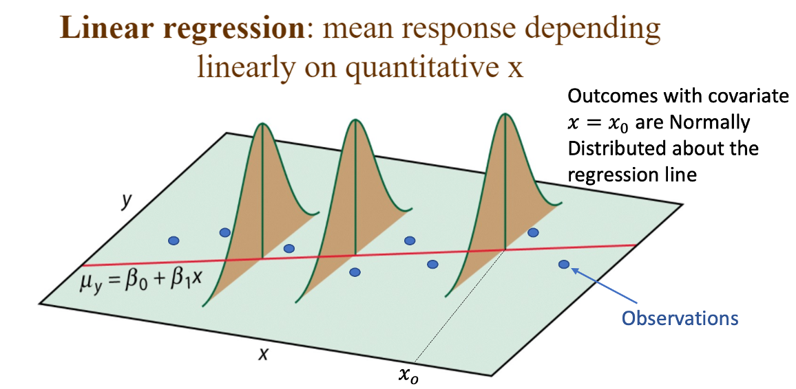
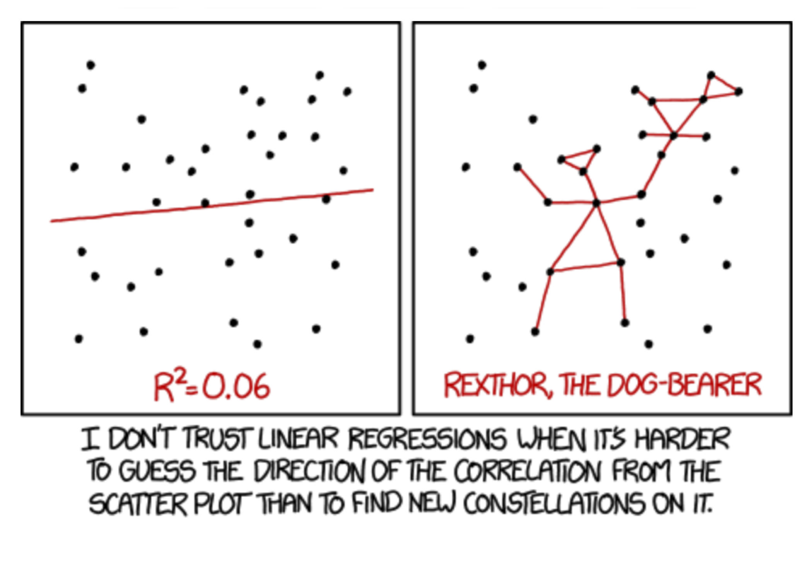

# 1A: Overview


<style>
body {
text-align: justify;
font-family: Helvetica;
font-size: 10pt;
}
hr{
height: 2px;
background-color: #000000;
border: none;
}
table, th, td {
  border: 1px solid black;
  border-collapse: collapse;
}
.vertical {
border-left: 6px solid black;
height: 200px;
position:absolute;
left: 50%;
        }
</style>

```{r setup, include = FALSE}
knitr::opts_chunk$set(fig.align='center')

colourise <- function(x, color) {
  if (knitr::is_latex_output()) {
    sprintf("\\textcolor{%s}{%s}", color, x)
  } else if (knitr::is_html_output()) {
    sprintf("<span style='color: %s;'>%s</span>", color,
      x)
  } else x
}

librarian::shelf(tidyverse, ggplot2, here, readxl, GGally, forecast, patchwork, MLmetrics, lmtest, latex2exp, scales, patchwork)
```

::: columns

:::: {.column width=60%}
`r colourise("**Simple linear regression (SLR)**", "red")` is a technique for modeling the relationship between two numerical variables $x$ and $y$. 

SLR can be visualized using a `r colourise("*scatterplot*", "blue")` in the xy-plane.

By estimating a straight line that `best fits' the data on a scatterplot, we obtain a linear model that can not only be used for `r colourise("*prediction*", "green")`, but also for `r colourise("*inference*", "green")` (with some additional assumptions).

---

```{r, include = FALSE}
librarian::shelf(tidyverse, oibiostat, ggsci, scales, plotly)
data(COL)
data(prevend.samp)
```

```{r echo=FALSE, fig.align="center"}
prevend.samp %>% 
  ggplot(aes(x = Age, y = RFFT)) + 
  geom_point(color = pal_aaas("default", alpha = 1)(9)[6]) + 
  theme_bw() + 
  xlab("Age (in years)") + 
  ylab("RFFT score") + 
  labs(title = "Scatterplot of RFFT score and Age in PREVEND data (n = 500)")
```


::::

:::: {.column width=40%}
#### The PREVEND study: As adults age, cognitive function changes over time; largely due to various cerebrovascular and neurodegenerative changes.

The **Prevention of REnal and Vascular END-stage Disease (PREVEND)** study measured various clinical data for participants.

- Cognitive function was assessed with the Ruff Figural Fluency Test (RFFT).

- Scores range from 0 to 175; higher scores indicate better cognitive function. 

- We will work with a random sample of 500 participants.

Various associated (*potentially*) demographic and cardiovascular risk factors were collected for each participant.
::::
:::


# 1B: Assumptions for linear regression

**The following conditions should be true in a scatterplot for a line to be considered a reasonable approximation to the relationship in the plot and for the application of the methods of inference (discussed later):**

>- *Linearity*: the data show a linear trend.
>- *Constant variability*: the variability of the response variable about the line remains roughly
constant as the predictor variable changes.
>- *Independent observations*: the (x,y) pairs are independent; i.e., values of one pair provide no information about values of other pairs.
>- *Approximate normality of residuals*: definition coming later...

>-
```{r echo = FALSE, fig.align = "center", fig.height = 6, fig.width=8}
data(frog)

frog %>% 
  drop_na() %>% 
  ggplot(aes(x = body.size, y = clutch.volume)) + 
  geom_point(color = pal_aaas("default", alpha = 1)(9)[3]) + 
  theme_bw() + 
  xlab("Female body size (in cm)") + 
  ylab("Clutch volume (cu. mm)") + 
  labs(title = "Question from this scatterplot: are the first three conditions met here?") + 
  theme(plot.title = element_text(face = "bold", color = "red"))
```

>- `r colourise("**The variability in volume is noticeably less for smaller values of body size than for larger values.**", "red")`

# 1C: Residuals in linear regression

**Our overarching goal is to fit a 'good' line to this data cloud. Suppose we know what the 'best' line that fits this data is.**  `r colourise("This means, for any given value of predictor $x$ we obtain a predicted $\\hat{y}.$", "blue")` `r colourise("In particular, for each observed data $(x_i, y_i)$ with $y_i$ being the observed response,  we get a predicted response $\\hat{y}_i.$", "green")`

<center>
```{r include = FALSE, fig.align="center"}
p <- prevend.samp %>% 
  ggplot(aes(x = Age, y = RFFT)) + 
  geom_point(color = pal_aaas("default", alpha = 1)(9)[6]) + 
  geom_smooth(method = lm, se = FALSE, color = pal_aaas("default", alpha = 1)(9)[4]) + 
    theme_bw() + 
    xlab("Age (in years)") + 
    ylab("RFFT score") + 
    labs(title = "Scatterplot of RFFT score and Age in PREVEND data (n = 500)", 
         subtitle = "Straight line is the best 'fitted' line.")
```
```{r echo = FALSE, fig.align="center", fig.height=5.5}
suppressMessages(ggplotly(p))
```
</center>

>- The vertical distance between a point in the scatterplot and the predicted value on the regression line is the **residual** for the point. `r colourise("For an observation $(x_i, y_i)$, where $\\hat{y}_i$ is the predicted value given by $$\\hat{y} = b_0 + b_1 x,$$ the residual is the value $$e_i = y_i - \\hat{y}_i.$$", "red")`

# 1D: Least squares regression

The least squares regression line is the line which minimizes the sum of the squared residuals for all the points in the plot.

In other words, the least squares line is the line with coefficients $b_0$ and $b_1$ such that the quantity $$e_1^2 + e_2^2 + \ldots + e_n^2$$ is the smallest posssible value it can take.

```{r include = FALSE, fig.align="center"}
prevend.samp <- prevend.samp %>% 
  add_column(RFFT_fit = lm(RFFT ~ Age, data = prevend.samp)$fitted.values)
```

<center>
```{r echo = FALSE, fig.align="center"}
suppressMessages(ggplotly(prevend.samp%>% 
  ggplot(aes(x = Age, y = RFFT)) + 
  geom_point(color = pal_aaas("default", alpha = 1)(9)[6]) + 
  geom_smooth(method = lm, se = FALSE, color = pal_aaas("default", alpha = 1)(9)[4]) + 
  theme_bw() + 
  xlab("Age (in years)") + 
  ylab("RFFT score") + 
  labs(title = "Scatterplot of RFFT score and Age in PREVEND data (n = 500)", 
       subtitle = "Straight line is the best 'fitted' line.") + 
  geom_point(data = prevend.samp %>% slice(c(500, 300, 100)), 
             aes(x = Age, y = RFFT),
             color = pal_aaas("default", alpha = 1)(9)[5], 
             size = 4, 
             shape = 5) + 
  geom_point(data = prevend.samp %>% slice(c(500, 300, 100)), 
             aes(x = Age, y = RFFT_fit),
             color = pal_aaas("default", alpha = 1)(9)[5], 
             size = 4, 
             shape = 2) + 
  geom_segment(data = prevend.samp %>% slice(c(500, 300, 100)), 
            aes(x = Age, y = RFFT, xend = Age, yend = RFFT_fit),
            color = pal_aaas("default", alpha = 1)(9)[5], 
            linetype = "dashed",
            size = 1.2)))

```
</center>

# 1E: Statistical model for least squares regression

For a general population of ordered pairs $(x, y)$, the **population regression model** is $$Y = \beta_0 + \beta_1X  + \epsilon,$$ where $\epsilon \sim N(0, \sigma)$ is the error term. 

Since $\mathrm{E}(\epsilon) = 0$, the population regression model may be rewritten in terms of conditional behaviour of $Y$ given $X = x$, i.e., $$\mathrm{E}(Y|X=x) = \beta_0 + \beta_1x.$$ 

```{r, echo=FALSE, fig.align="center", fig.height= 8}
   
```

The terms $\beta_0$ and $\beta_1$ are **parameters** - with $b_0$ and $b_1$ serving as **estimates**. 

We will use `R` to (a) obtain estimates $b_0$ and $b_1$, (b) check validity of assumptions of linear regression.


# 1F: `lm()` for categorical predictors with two levels

Although the response variable in linear regression is necessarily numerical, the predictor may be either numerical or categorical. Simple linear regression only allows for categorical predictor variables with two levels. Examining categorical predictors with more than two levels requires multiple linear regression.

Fitting a simple linear regression model with a two-level categorical predictor is analogous to comparing the means of two groups, where the groups are defined by the categorical variable.

Here, we examine if there are any gender-based differences in RFFT scores in the PREVEND dataset. First, we compare the gender-stratified distribution of RFFT scores by means of violin plots.

```{r echo = FALSE, fig.align='center', fig.width=8}
prevend.samp %>% 
  rowwise() %>% 
  mutate(Gender = factor(ifelse(Gender == 1, "Male", "Female"))) %>% 
  ggplot(aes(x = RFFT, y = Gender, fill = Gender), color = "black") + 
  geom_violin(draw_quantiles = c(0.25, 0.5, 0.75)) + 
  scale_fill_aaas() + 
  coord_flip() +
  theme_bw() + 
  xlab("RFFT score") + 
  ylab("") + 
  labs(title = "Examining violin of RFFT scores in PREVEND data (n = 500) after stratifying by gender.") + 
  theme(legend.position = "bottom")
```

We compare the group means as follows
```{r}
prevend.samp %>% 
  rowwise() %>% 
  mutate(Gender = factor(ifelse(Gender == 1, "Male", "Female"))) %>% 
  group_by(Gender) %>% ## stratifying by gender
  summarise(m = mean(RFFT), ## strata-specific means
            q1 = quantile(RFFT, 0.25), ## strata-specific quantiles 
            q2 = quantile(RFFT, 0.5),
            q3 = quantile(RFFT, 0.75))
``` 
and fit a linear model of RFFT by gender
```{r echo = FALSE}
data = prevend.samp %>% 
  rowwise() %>% 
  mutate(Gender = factor(ifelse(Gender == 1, "Male", "Female"))) 
```

```{r}
lm(RFFT ~ Gender, data = data)
```
Note that the estimated intercept is the group mean for one category (called the baseline) - here it is the `Gender = Male` group. The estimated slope is the difference of the group means.

# 1G: The quantity $R^2$

::: columns

:::: {.column width=60%}
```{r, echo=FALSE, fig.align="center", fig.height= 8}

```
::::

:::: {.column width=40%}
The correlation coefficient $r$ measures the strength of the linear relationship between two
variables. 

It is more common to use $R^2$ to measure the strength of a linear fit. 

$R^2$ describes the amount of variation in the response that is explained by the least squares line. 

$$R^2 = \frac{\text{variance of predicted y-values }}{\text{variance of observed y-values}} = \frac{\mathrm{V}(\hat{Y})}{\mathrm{V}({Y})}.$$

If a linear model perfectly captured the variability in the observed data, then $\mathrm{V}(\hat{Y}) = \mathrm{V}(Y)$ and $R^2$ would be 1.

$R^2$ can also be calculated as follows
\begin{align*}
R^2 &= \frac{\text{variance of observed y-values} - \text{variance of residuals}}{\text{variance of observed y-values}}\\
&= \frac{\mathrm{V}({Y}) - \mathrm{V}({e})}{\mathrm{V}({Y})}.
\end{align*}


The variability of the residuals about the fitted line represents the remaining variability *after* the model is fit. In other words, $\mathrm{V}({e})$ is the variability unexplained by the model.
::::
:::

# 1H: Hypothesis testing in regression

Inference in a regression context is usually about the slope parameter $\beta_1$. The null hypothesis is most commonly a hypothesis of ‘no association’, which may be formulated mathematically as 
`r colourise("$$H_0: \\beta_1 = 0 \\text{ [denoting X and Y are NOT associated]}.$$", "red")` The alternative hypothesis is given by 
`r colourise("$$H_0: \\beta_1 \\neq 0 \\text{ [denoting X and Y are associated]}.$$", "green")` 
We use estimator $b_1$ in the statistic used to test whether hypothesis $H_0$ is true. The test statistic is given by 
$$t = \frac{b_1 - \beta_1^0}{\text{s.e.}(b_1)} = \frac{b_1}{\text{s.e.}(b_1)},$$ where $\beta_1^0$ equals zero when the null hypothesis is true.

The $t-$statistic defined above follows a $t-$distribution with degrees of freedom $n − 2$, where $n$ is the number of ordered pairs $(x_i, y_i)$ in the dataset.

`r colourise("In order to test whether $H_0$ holds or not, we construct the $95\\%$ confidence interval associated with $\\beta_1$ and investigate if the resultant confidence interval contains zero or not. The $95\\%$ C.I. is given by 
$$b_1 \\pm \\left(t^* \\times \\text{s.e.}(b_1) \\right),$$", "blue")` where $t^*$ is the *97.5-th percentile of a t-distribution with (n-2) degrees of freedom.* (may be computed in `R` as `qt(p = 0.975, df = n-2)`). 

<center>`r colourise("Thankfully, R does most of the hard work for us!", "red")`</center>


# Lab 1: `R` for simple linear regression

Notes for review may be found [here](https://rpubs.com/soumikp/bdsi22LinRegNotes).

## Exercise 1 of 1: Using `lm()` to analyse data from the PREVEND study
<details><summary>Click here for more details</summary>
This lab uses data from the Prevention of REnal and Vascular END-stage Disease (PREVEND) study, which took place between 2003 and 2006 in the Netherlands. Clinical and demographic data for a random sample of 500 individuals are stored in the `prevend.samp` dataset in the     `oibiostat` package. 

```{r eval = FALSE}
install.packages("devtools")
devtools::install_github("OI-Biostat/oi_biostat_data")
```
As adults age, cognitive function declines over time; this is largely due to various cerebrovascular and neurodegenerative changes. The Ruff Figural Fluency Test (RFFT) is one measure of cognitive function that provides information about cognitive abilities such as planning and the ability to switch between different tasks. Scores on the RFFT range from 0 to 175 points, where higher scores are indicative of better cognitive function.

The goal of this lab is to begin exploring the relationship between age and RFFT score in the `prevend.samp` dataset.
```{r}
library(oibiostat)
data(prevend.samp)
```

a) Create a scatterplot of RFFT score and age in years in `prevend.samp`. <details> <summary>Click here for answer</summary> 
    ```{r, echo = TRUE} 
  prevend.samp %>% 
  ggplot(aes(x = Age, y = RFFT)) + 
  geom_point() + ## bonus
  theme_bw() + 
  ylab("RFFT score") + 
  xlab("Age (in years)") + 
  labs(title = "Scatterplot of RFFT scores and age (in years) for PREVEND data (n = 500).") + 
  theme(legend.position = "bottom")
    ``` 
 </details>
 
 
b) `r colourise("BONUS: can you stratify by gender? Use different shapes and colours to differentiate between observations from male participants and female participants?", "red")` <details> <summary>Click here for answer</summary> 
    ```{r, echo = TRUE} 
  prevend.samp %>% 
  rowwise() %>% 
  mutate(Gender = factor(ifelse(Gender == 1, "Male", "Female"))) %>% 
  ggplot(aes(x = Age, y = RFFT)) + 
  geom_point(aes(color = Gender, shape = Gender)) + ## bonus
  theme_bw() + 
  ylab("RFFT score") + 
  xlab("Age (in years)") + 
  labs(title = "Scatterplot of RFFT scores and age (in years) for PREVEND data (n = 500).") + 
  theme(legend.position = "bottom") + 
  scale_color_aaas()
    ``` 
 </details>
      
    
c) Examine the plot and consider possible lines that are a reasonable approximation for the relationship in the plot. Consider the line $\hat{y} = -20 + 2x$. We add the line to the scatterplot. Does the line appear to be a good fit to the data? <details><summary>Click here for answer</summary>
    ```{r echo = TRUE} 
  prevend.samp  %>% 
  ggplot(aes(x = Age, y = RFFT)) + 
  geom_point(color = pal_aaas("default", alpha = 1)(9)[4]) +
  geom_abline(slope = 2, intercept = -20, 
              linetype = "dashed", color = pal_aaas("default", alpha = 1)(9)[6], size = 1) +    
  theme_bw() + 
  ylab("RFFT score") + 
  xlab("Age (in years)") + 
  labs(title = "Scatterplot of RFFT scores and age (in years) for PREVEND data (n = 500).") + 
  theme(legend.position = "bottom")
    ```
    `r colourise("No, the line does not appear to be a good fit to the data. The general trend in the data is a negative relationship, while the line has a positive slope.", "red")` 
 </details>

d) Calculate the SSE, the sum of the squared residuals, for this line. Do you expect this SSE to be relatively low or relatively high? Explain your answer. <details><summary>Click here for answer</summary>
    ```{r echo = TRUE} 
  #enter line coefficients
  b0 = -20
  b1 = 2
  #calculate sse
  y = prevend.samp$RFFT
  x = prevend.samp$Age
  sse = sum((y - (b0 + b1*x))^2)
  sse
    ```
`r colourise("Since we do not expect the model fit to be 'good', the SSE should be relatively high, indicating a poor model fit and high amount of error (from large residuals) associated with the model. The SSE is 1,206,875.", "red")` 
 </details>
      
e) Create a scatterplot of RFFT score and age in years in `prevend.samp`, then add a line of best fit. <details><summary>Click here for answer</summary>
    ```{r}
    prevend.samp %>% 
  ggplot(aes(x = Age, y = RFFT)) + 
  geom_point(color = pal_aaas("default", alpha = 1)(9)[4]) +
  theme_bw() + 
  stat_smooth(method = lm, se = TRUE, 
              color = pal_aaas("default", alpha = 1)(9)[6], linetype = "dashed", size = 1) +
  ylab("RFFT score") + 
  xlab("Age (in years)") + 
  labs(title = "Scatterplot of RFFT scores and age (in years) for PREVEND data (n = 500) with line of best fit (grey band gives 95% CI)") + 
  theme(legend.position = "bottom")
```     
  </details>

f) Print the summary of the best-fitting model and interpret your findings.<details><summary>Click here for answer</summary>
    ```{r}
    summary(lm(RFFT ~ Age, data = prevend.samp))
```     
    - The slope is -1.261 and the intercept is 137.55.
    - According to the `r colourise("*model slope*", "blue")`, an increase in age of 1 year is associated with an *average decrease* in RFFT score by 1.3 points.
    - The `r colourise("*model intercept*", "green")` suggests that the average RFFT score for an individual of age 0 is 137.55. The intercept value does not have interpretive meaning in this setting, since it is not reasonable to assess a newborn's cognitive function with a test like the RFFT.
    - Based on the linear model, RFFT score differs, on average, by $1.261(T_2 - T_1) = 12.61$ points for individuals that have an age difference of $T_2 - T_1$ years; the younger individual (with age $T_1$) is expected to have a higher RFFT score.
    - The average RFFT score for an individual who is 70 years old is given by $\hat{RFFT} = 137.55 - (1.261)(70) = 49.28$ points.
    - `r colourise("It is not valid to use the linear model to estimate RFFT score for an individual who is 20 years old", "red")`: The data in the sample only extend from ages 36 to 81 and should not be used to predict scores for individuals outside that age range. It may well be that the relationship between RFFT and age is different for individuals in a different age group.
  </details>
</details>


# 2A: Introduction to multiple linear regression

In most practical settings, more than one explanatory variable is likely to be associated with a response.

Multiple linear regression is used to estimate the linear relationship between a response variable $Y$ and several predictors $x_1, x_2,\ldots, x_p$, where $p$ is the number of predictors.

We extend the statistical model from just one predictor to $p-$many predictors as follows 
`r colourise("$$\\mathrm{E}(Y|x_1, x_2, \\ldots, x_p) = \\beta_0 +\\beta_1x_1 +\\beta_2x_2 +···+\\beta_px_p.$$", "red")`

There are several applications of multiple regression. We will focus on two areas:

- Estimating an association between a response variable and primary predictor of interest while adjusting for possible confounding variables.
- Constructing a model that effectively explains the observed variation in the response variable.

We will again make use of the `prevend.sample` dataset in this module, but this time we'll consider a more complicated example concerning the effect of `r colourise("statin use", "red")` on `r colourise("cognitive function (through RFFT scores)", "blue")`.

<hr>

### Statin use and cognitive function.

Statins are a class of drugs widely used to lower cholesterol. If followed, recent guidelines for prescribing statins would lead to statin use in almost half of Americans between 40 - 75 years of age and nearly all men over 60.

`r colourise("**A few small studies have suggested that statins may be associated with lower cognitive ability.**", "red")`

The PREVEND study collected data on statin use as well as other demographic factors.

# 2B: Age, statin use and cognitive function

::: columns

:::: {.column width=70%}

```{r echo = FALSE, warning=FALSE, message=FALSE, fig.align="center", fig.height=10.5, fig.width=13}
p1 <- suppressMessages(prevend.samp %>% 
  rowwise() %>% 
  mutate(Statin = factor(ifelse(Statin == 1, "Yes", "No"), 
                         levels = c("No", "Yes"))) %>%
  ggplot(aes(x = Age, y = RFFT)) + 
  geom_point(aes(color = Statin), alpha = 0.8) + 
  geom_smooth(method = lm, se = FALSE, 
              color = "black") + 
  geom_vline(xintercept = c(40, 50, 60, 70, 80), 
             linetype = "dashed", 
             alpha= 0.6,) + 
  theme_bw() + 
  scale_color_aaas() + 
  xlab("Age (in years)") + 
  ylab("RFFT score") + 
  labs(title = "(A) RFFT score versus Age (in years) in PREVEND (n = 500).",
       subtitle = "Line in black is the best linear regression fit.",
       color = "Statin use") + 
  theme(legend.position = "bottom", 
        title = element_text(face = "bold")))

p2 <- prevend.samp %>% 
  rowwise() %>% 
  mutate(Statin = factor(ifelse(Statin == 1, "Yes", "No"), 
                         levels = c("No", "Yes"))) %>%
  ggplot(aes(y = RFFT, x = Statin)) + 
  geom_boxplot(aes(fill = Statin)) + 
  theme_bw() + 
  scale_fill_aaas() + 
  xlab("Statin use") + 
  ylab("RFFT score") + 
  labs(title = "(B) RFFT score in PREVEND (n = 500), stratified by Statin use.",
       fill = "Statin use") + 
  theme(legend.position = "bottom", 
        title = element_text(face = "bold"))

p3 <- prevend.samp %>% 
  rowwise() %>% 
  mutate(Statin = factor(ifelse(Statin == 1, "Yes", "No"), 
                         levels = c("No", "Yes"))) %>%
  ggplot(aes(y = Age, x = Statin)) + 
  geom_boxplot(aes(fill = Statin)) + 
  theme_bw() + 
  scale_fill_aaas() + 
  xlab("Statin use") + 
  ylab("Age (in years)") + 
  labs(title = "(C) Age (in years) in PREVEND (n = 500), stratified by Statin use.",
       fill = "Statin use") + 
  theme(legend.position = "bottom", 
        title = element_text(face = "bold"))

suppressMessages(p1/(p2 + p3))
```
::::

:::: {.column width=30%}
>- `r colourise("Red", "red")` dots indicate users and `r colourise("blue", "blue")` dots represent non-users of Statin.
>- From figure (A) we see a deterioriation in cognitive function as age increases: `r colourise("can you recall what the estimated slope was?", "green")`
>- From Figure (B) we observe that the average RFFT score is probably lower among users of statin as compared to non-users: `r colourise("can you formulate this as a statistical hypothesis and test for the same?", "green")`
>- From Figure (C) we observe that the average age is probably higher among users of statin as compared to non-users: `r colourise("can you again formulate this as a statistical hypothesis?", "green")`   
>- `r colourise("**Challenge: investigate the association between cognitive function and statin use after adjusting for age as a potential confounder.**", "red")`   
::::
:::

# 2C: Interpreting coefficients in multiple linear regression

The statistical model for multiple regression is based on  $$\mathrm{E}(Y|x_1, x_2, \ldots, x_p) = \beta_0 + \beta_1 x_1 + \ldots + \beta_p x_p,$$
where $p$ is the number of predictors.

The coefficient $\beta_j$ of a predictor $X_j$ is estimated by $b_j$, say. It iss the predicted mean change in the response corresponding to a
one unit change in $x_j$ , *when the values of all other predictors remain constant*. 

`r colourise("**The practical interpretation is that a coefficient in multiple regression estimates the association between a response and that predictor, after adjusting for the other predictors in the model.**", "blue")`

<hr>

### Assumptions for multiple regression: 

Similar to those of simple linear regression...

1.  **Linearity:** For each predictor variable $X_j$, change in the predictor is linearly related to change in the response variable *when the value of all other predictors is held constant.*
2. **Constant variability:** The residuals have approximately constant variance.
3. **Independent observations:** Each set of observations $(y, x_1, x_2, \ldots, x_p)$ is independent.
4. **Normality of residuals:** The residuals are approximately normally distributed.

`r colourise("**It is not possible to make a scatterplot of a response against several simultaneous predictors :(**", "red")`

# 2D: Model diagnostics and assessment

It is not possible to make a scatterplot of a response against several simultaneous predictors. 

- `r colourise("**To assess linearity:** use a modified residual plot.", "green")`
    - For each (numerical) predictor, plot the `r colourise("residuals on the y-axis", "blue")` and the `r colourise("predictor values", "red")` on the x-axis.
    - Patterns/curvature are indicative of non-linearity.
    
- `r colourise("**To assess constant variablity:** use the same approach as for simple regression", "green")`
    - For each (numerical) predictor, plot the `r colourise("residuals on the y-axis", "blue")` and the `r colourise("predicted values", "purple")` on the x-axis.

- `r colourise("**To assess normality of residuals:** use the same approach as for simple regression", "green")`
    - construct and study Q-Q plot for the `r colourise("residuals", "blue")`.

<hr>

## Adjusted $R^2$ as a tool for model assessment

`r colourise("**More information is always nice**", "green")`: As variables are added, $R^2$ always increases. 

`r colourise("**But at what cost?**", "red")`: As variables are added, model complexity increases. 

We consider using **adjusted $R^2$** ($R^2_{\text{adj}}$) as a tool for model assesment. 

$$R^2_{\text{adj}} = 1 - (1 - R^2)\times \frac{n-1}{n-1-p}.$$

`r colourise("It is often used to balance predictive ability with model complexity.", "green")` $R^2_{\text{adj}}$ incorporates a penalty for including predictors that do not contribute much towards explaining observed variation in the response variable.

`r colourise("Unlike $R^2$, $R^2_{\\text{adj}}$ does not have an inherent interpretation.", "red")`

# 2E: Testing hypotheses for multiple linear regression models

## Testing hypothesss about slope coefficients: $t-$tests.

Typically, the hypotheses of interest are $H^k_{0}: \beta_k = 0$ ($X_k$ and $Y$ are NOT associated) with alternative $H^k_A: \beta_k \neq 0$ ($X_k$ and $Y$ are associated). 

The test statistic is again a t-statistic under the null, with degrees of freedom $= n - p - 1$, given by $$t_k = \frac{b_k - \beta_k^0}{\text{s.e.}(b_k)},$$ with a $95\%$ confidence interval for $\beta_k$ given by $$b_k \pm \left(t^* \times \text{s.e.}(b_k) \right),$$ where $t^*$ is the $97.5-$th percentile for a $t-$distribution with $n-p-1$ degrees of freedom.

<hr>

## Testing overall goodness of model: $F-$tests.

The $F-$statistic is used in an overall test of the model to assess whether the predictors in the
model,  considered as a group, are associated with the response.


$$H_0 :\beta_1 = \beta_2 =\ldots=\beta_p = 0 \text{ vs } H_A: H_0 \text{ is false,}$$ 
where $H_0$ is false **if and only if at least one of the slope coefficients $\beta_k$ is not 0**

`r colourise("There is sufficient evidence to reject $H_0$ if the $p-$value of the $F-$statistic is smaller than or equal to $\\alpha.$", "red")`

`r colourise("Again, R does the hard work for us: the F-statistic and its associated p-value are displayed in the output", "blue")`.

# 2F: Interaction in regression

The multiple regression model assumes that when one of the predictors $x_j$ is changed by 1 unit and the values of the other variables remain constant, the predicted response changes by $\beta_j$, regardless of the values of the other variables.

A statistical interaction occurs when this assumption is not true, such that the effect of one explanatory variable $x_j$ on the response depends on the particular value(s) of one or more other explanatory variables.

As an example, we specifically examine interaction in a two-variable setting, where one of the predictors is categorical and the other is numerical.

Consider data on total cholesterol level (mmol/L) from age (yrs.) and diabetes status in a dataset of size $n = 473$.

```{r echo = FALSE}
library(oibiostat) 
data("nhanes.samp.adult.500")

nhanes.samp.adult.500 %>% 
  select(c(TotChol, Age, Diabetes)) %>% 
  drop_na() %>% 
  ggplot(aes(x = Age, y = TotChol)) + 
  geom_point(aes(color = Diabetes)) + 
  scale_color_aaas() +
  xlab("Age (in years)") + 
  ylab("Total cholesterol (mmol/L)") + 
  labs(title = "Cholesterol vs Age (n = 473)",
       subtitle = "Stratified by diabetes status") + 
  theme_bw() + 
  theme(legend.position = "bottom", 
        title = element_text(face = "bold"))
```

We fit the linear model $$\mathrm{E}(\text{Total cholesterol|Age, Diabetes status}) = \beta_0 + \beta_1 \text{Age} + \beta_2 \mathrm{I}(\text{has diabetes}).$$
This model yields two fitted lines, one for `r colourise("individuals with diabetes", "red")` and one for `r colourise("individuals without diabetes", "blue")` - we overlay these fitted lines on the scatterplot.

```{r echo = FALSE}
model_no_int <- lm(TotChol ~ Age + Diabetes, data = nhanes.samp.adult.500)

no_dia <- c(coefficients(model_no_int)[1], coefficients(model_no_int)[2])
dia <- c(coefficients(model_no_int)[1] + coefficients(model_no_int)[3], coefficients(model_no_int)[2])

nhanes.samp.adult.500 %>% 
  select(c(TotChol, Age, Diabetes)) %>% 
  drop_na() %>% 
  ggplot(aes(x = Age, y = TotChol)) + 
  geom_point(aes(color = Diabetes)) + 
  geom_abline(slope = no_dia[2], intercept = no_dia[1], 
              color = pal_aaas()(2)[1], 
              size = 1) + 
  geom_abline(slope = dia[2], intercept = dia[1], 
              color = pal_aaas()(2)[2], 
              size = 1) +
  scale_color_aaas() + 
  xlab("Age (in years)") + 
  ylab("Total cholesterol (mmol/L)") + 
  labs(title = "Cholesterol vs Age in NHANES (n = 500)") + 
  theme_bw() + 
  theme(legend.position = "bottom", 
        title = element_text(face = "bold"))
```

Next, we consider two separate  models for the relationship between total cholesterol and age; one in diabetic individuals and one in non-diabetic individuals. 

```{r echo=FALSE, message = FALSE, fig.width=16}
(nhanes.samp.adult.500 %>% 
  select(c(TotChol, Age, Diabetes)) %>% 
  filter(Diabetes == "Yes") %>% 
  drop_na() %>% 
  ggplot(aes(x = Age, y = TotChol)) + 
  geom_point(color = pal_aaas()(2)[2]) + 
  geom_smooth(method = lm, se = FALSE, color = pal_aaas()(2)[2]) +
  scale_color_aaas() +
  xlab("Age (in years)") + 
  ylab("Total cholesterol (mmol/L)") + 
  labs(title = "Cholesterol vs Age for diabetics (n = 53)", 
       subtitle = "Fitted line: 6.42 - 0.023 Age") + 
  theme_bw() + 
  theme(legend.position = "none", 
        title = element_text(face = "bold"))) + 
  (nhanes.samp.adult.500 %>% 
     select(c(TotChol, Age, Diabetes)) %>% 
     filter(Diabetes == "No") %>% 
     drop_na() %>% 
     ggplot(aes(x = Age, y = TotChol)) + 
     geom_point(color = pal_aaas()(2)[1]) + 
     geom_smooth(method = lm, se = FALSE, color = pal_aaas()(2)[1]) +
     scale_color_aaas() +
     xlab("Age (in years)") + 
     ylab("Total cholesterol (mmol/L)") + 
     labs(title = "Cholesterol vs Age for non-diabetics (n = 420)", 
          subtitle = "Fitted line: 4.70 + 0.0096 Age") + 
     theme_bw() + 
     theme(legend.position = "none", 
           title = element_text(face = "bold")))
```

<center>`r colourise("**So it seems that diabetes status influences how age and cholesterol levels are associated.**", "red")` This calls for the inclusion of an `r colourise("**interaction term **", "green")` in the model.</center> 

$$\mathrm{E}(\text{Total cholesterol|Age, Diabetes status}) = \beta_0 + \beta_1 \text{ Age } + \beta_2 \ \mathrm{I}(\text{has diabetes}) + \beta_3 \text{ Age } \times \ \mathrm{I}(\text{has diabetes}).$$ 
The estimated model coefficients are given by 
```{r echo = FALSE}
coefficients(lm(TotChol ~ Age*Diabetes, data = nhanes.samp.adult.500))
```
$$\widehat{TotChol} = 4.70 + 0.0096 \times \text{ Age} + 1.72 \times \ \mathrm{I}(\text{has diabetes}) - 0.033 \times \text{ Age }\times \mathrm{I}(\text{has diabetes}).$$ 

Hence the fitted model equation for diabetics is given by $$\widehat{TotChol} = 6.42 - 0.023 \times \text{Age},$$ and that for non-diabetics is given by $$\widehat{TotChol} = 4.70 + 0.0096 \times \text{Age}.$$ 

<center>`r colourise("**These were the fitted models we obtained by fitting the models separately!**", "green")`</center>


# Lab 2: `R` for multiple linear regression

Notes for review may be found [here](https://rpubs.com/soumikp/bdsi22LinRegNotes).

## Exercise 1 of 2: Verify validity of linear model assumptions for PREVEND study
<details><summary>Click here for more details</summary>

Having fit a multiple regression model predicting RFFT score from statin use and age, we will check the assumptions for multiple linear regression.
```{r}
library(oibiostat)
data(prevend.samp)

prevend.samp <- prevend.samp %>% 
  rowwise() %>% 
  mutate(Statin = factor(ifelse(Statin == 1, "Yes", "No"))) %>% 
  select(c(RFFT, Age, Statin))

#fit a multiple regression model
model1 = lm(RFFT ~ Statin + Age, data = prevend.samp)
```

a. Assess linearity with respect to age using a scatterplot with residual values on the $y$-axis and values of age on the $x$-axis. Is it necessary to assess linearity with respect to statin use? <details> <summary>Click here for more details</summary>
    ```{r}
    plot(resid(model1) ~ prevend.samp$Age,
     main = "Residuals vs Age in PREVEND (n = 500)",
     xlab = "Age (years)", ylab = "Residual",
     pch = 21, col = "cornflowerblue", bg = "slategray2",
     cex = 0.60)
    abline(h = 0, col = "red", lty = 2)
    ```
     `r colourise("There are no apparent trends; the data scatter evenly above and below the horizontal line. There does not seem to be remaining nonlinearity with respect to age after the model is fit.", "blue")`
     
     `r colourise("It is not necessary to assess linearity with respect to statin use since statin use is measured as a categorical variable. A line drawn through two points (that is, the mean of the two groups defined by a binary variable) is necessarily linear.", "blue")`
  </details>
  
b. Assess whether the residuals have approximately constant variance. <details> <summary>Click here for more details</summary>
    ```{r}
    #assess constant variance of residuals
      plot(resid(model1) ~ fitted(model1),
     main = "Resid. vs Predicted RFFT in PREVEND (n = 500)",
     xlab = "Predicted RFFT Score", ylab = "Residual",
     pch = 21, col = "cornflowerblue", bg = "slategray2",
     cex = 0.60)
    abline(h = 0, col = "red", lty = 2)
    ```
    `r colourise("The variance of the residuals is somewhat smaller for lower predicted values of RFFT score, but this may simply be an artifact from observing few individuals with relatively low predicted scores. It seems reasonable to assume approximately constant variance.", "blue")`
  </details>
  
c. Assess whether the residuals are approximately normally distributed. <details> <summary>Click here for more details</summary>
    ```{r}
    #assess normality of residuals
    qqnorm(resid(model1),
           pch = 21, col = "cornflowerblue", bg = "slategray2", cex = 0.75,
           main = "Q-Q Plot of Residuals")
    qqline(resid(model1), col = "red", lwd = 2)
    ```
    `r colourise("The residuals are reasonably normally distributed, with only slight departures from normality in the tails.", "blue")`
  </details>  

d. How well does the model explain the variability in observed RFFT score?<details> <summary>Click here for more details</summary>
    ```{r}
    summary(model1)$r.squared
    ```
    `r colourise("The $R^2$ is 0.285; the model explains 28.5% of the observed variation in RFFT score. The moderately low $R^2$ suggests that the model is missing other predictors of RFFT score.", "blue")`
  </details>  
  
e. Calculate the adjusted $R^2_{\text{adj}}$ for the multiple regression model predicting RFFT score from statin use and age. <details> <summary>Click here for more details</summary>
    ```{r}
    summary(model1)$adj.r.squared
    ```
    `r colourise("The $R^2_{\\text{adj}}$ is 0.282.", "blue")`
  </details>
</details>

## Exercise 2 of 2: Model interaction effects for PREVEND study
<details><summary>Click here for more details</summary>

The following set of questions step through taking a closer look at the association of RFFT score with age and statin with `prevend.samp`, a sample of $n = 500$ individuals from the PREVEND data.

Run the code in the template to fit a model for predicting RFFT score from age, statin use, and the interaction term between age and statin use.

```{r}
#load the data
library(oibiostat)
data("prevend.samp")
#convert Statin to a factor
prevend.samp$Statin = factor(prevend.samp$Statin, levels = c(0, 1),
                             labels = c("NonUser", "User"))
#fit the model
model.RFFT.interact = lm(RFFT ~ Age*Statin, data = prevend.samp)
coef(model.RFFT.interact)
```

a.  Write the overall model equation.  <details> <summary>Click here for more details</summary>
    `r colourise("$$\\widehat{RFFT} = 140.20 - 1.31 \\times \\text{Age} - 13.97 \\times \\mathrm{I}(\\text{Statin user}) + 0.25\\times \\text{Age} \\times \\mathrm{I}(\\text{Statin User})$$", "blue")`
  </details>
  
b.  Write the model equation for statin users.  <details> <summary>Click here for more details</summary>
    `r colourise("$$\\widehat{RFFT} = 126.23 - 1.06 \\times \\text{Age}$$", "blue")`
  </details>
  
c.  Write the model equation for non-statin users.  <details> <summary>Click here for more details</summary>
    `r colourise("$$\\widehat{RFFT} = 140.20 - 1.31 \\times \\text{Age}$$", "blue")`
  </details>  


  
d. Is there evidence of a statistically significant interaction between age and statin use? <details> <summary>Click here for more details</summary>
    ```{r}
    summary(model.RFFT.interact)
    ```
    `r colourise("No, there is not evidence of a statistically significant interaction between age and statin use. The $p$-value associated with the interaction term is 0.317.", "blue")`
  </details>
</details>
  


  


# $\infty$   
```{r, echo=FALSE, fig.align="center", fig.height= 20, fig.width=28}
knitr::include_graphics('./figures/taf.png')
```

